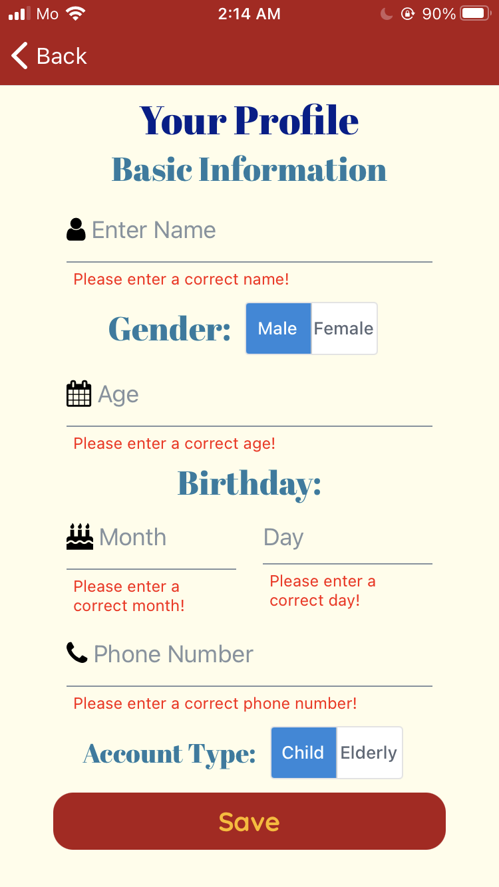

# Memory by Memory - hackUST 2021

An mobile application that aim at bridging the gap of distance and communication between generations.


## Install Standalone Apps
Android: [Download from github](download/Memory%20by%20Memory.apk)
or [Direct Download](https://expo.io/artifacts/fec182de-b946-46cd-b3f9-1e8300bed19a)
or [Use the Expo App to connect](https://expo.io/@bonzili/projects/HackUST-2021)

Web preview (For preview only. Most of the function do not work on web): [https://memorybymemory.vercel.app/](https://memorybymemory.vercel.app/)

## Main feature:
- Chatbot (Functional)
- Voicebot (In progress)
- User proile (Functional)

## Screenshots:
Front Page |  Home Page | Profile Page |
:-------------------------:|:-------------------------:|:-------------------------:
 |   | 


## Setup
Requirements:
[Node.js LTS release](https://nodejs.org/en/), [Git](https://git-scm.com/), [Yarn](https://classic.yarnpkg.com/en/docs/install)

To run this project, install it locally using npm or yarn.

```bash
npm install --global expo-cli
yarn add expo
expo start
```
